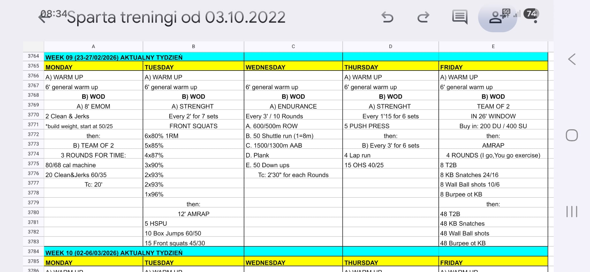

```markdown
# Week 09 (23-27/02/2026)

## Source Screenshot

[Open source screenshot](../../../assets/images/week_09_source.jpg)



## Overview
This week features a mix of heavy lifting, high-intensity intervals, and long endurance pieces.

*   **[Monday](monday.md)** – Clean & Jerk EMOM & Team Machine Sprint
*   **[Tuesday](tuesday.md)** – Heavy Front Squats & Gymnastic AMRAP
*   **[Wednesday](wednesday.md)** – Endurance Intervals
*   **[Thursday](thursday.md)** – Push Press & Overhead Squat Intervals
*   **[Friday](friday.md)** – Team AMRAP & Gymnastic Chipper

## Focus Areas
*   **Strength:** Front Squats, Push Press, Clean & Jerks
*   **Gymnastics:** HSPU, T2B
*   **Conditioning:** Machine sprints, long endurance intervals, team chippers
```