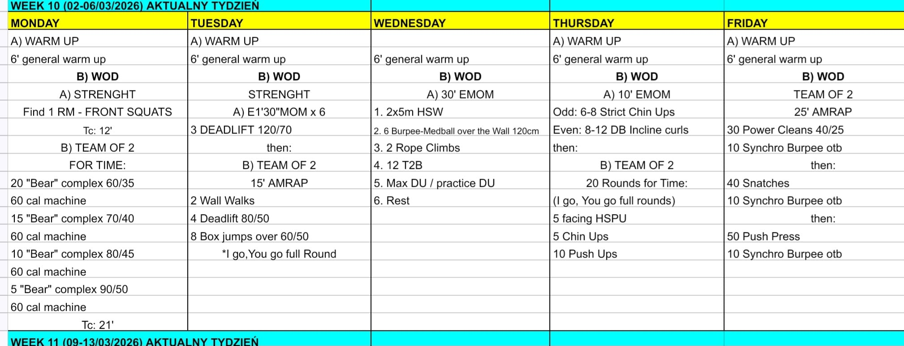

# Week 10 (02-06/03/2026)

## Source Screenshot

[Open source screenshot](../../../assets/images/week_10_source.jpeg)

## Overview

Transcribed from the weekly board.

- **[Monday](monday.md)** – Front Squat 1RM + Team of 2 Bear Complex/Calories
- **[Tuesday](tuesday.md)** – Deadlift E1:30 x 6 + Team AMRAP
- **[Wednesday](wednesday.md)** – 30' EMOM skills/engine mix
- **[Thursday](thursday.md)** – Chin-Up/Curl EMOM + Team 20 Rounds For Time
- **[Friday](friday.md)** – Team 25' AMRAP barbell + synchro burpees
