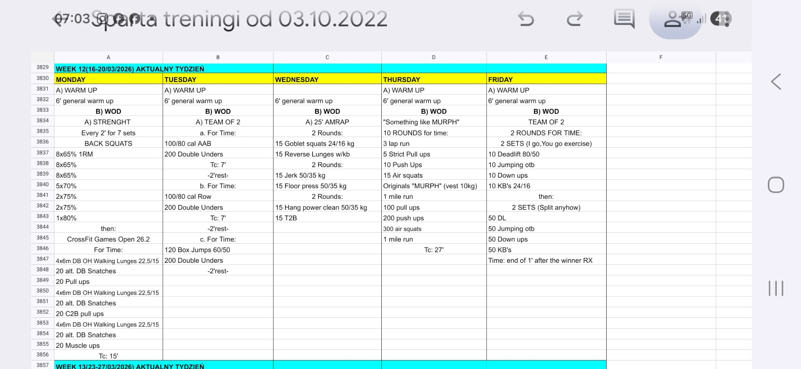

# Week 12 (16-20/03/2026)

## Source Screenshot

[Open source screenshot](../../../assets/images/week_12_source.jpeg)

## Overview

Transcribed from the weekly board.

## Daily Workouts
- **[Monday](monday.md)** – Back Squat E2MOM + Open 26.2
- **[Tuesday](tuesday.md)** – Team bike / row / box jump and double-under intervals
- **[Wednesday](wednesday.md)** – 25 min AMRAP with KB, barbell, floor press, and T2B
- **[Thursday](thursday.md)** – "Something Like Murph" – 10 rounds for time
- **[Friday](friday.md)** – Team deadlift, jumping OTB, down-up, and KB swing workout
