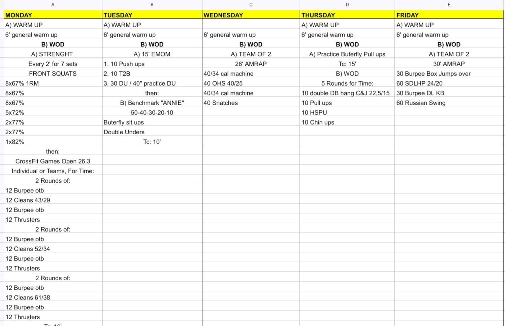

# Week 13 (23-27/03/2026)

## Source Screenshot

## Overview

Transcribed from the weekly board.

## Daily Workouts
- **[Monday](monday.md)** – Back Squat E2MOM + Open 26.3 ascending barbell (cleans & thrusters)
- **[Tuesday](tuesday.md)** – 15 min EMOM (push-ups / T2B / DU) + Benchmark "ANNIE"
- **[Wednesday](wednesday.md)** – Team of 2, 26 min AMRAP (machine cals / OHS / snatches)
- **[Thursday](thursday.md)** – Butterfly pull-up skill + 5 rounds (DB hang C&J / pull-ups / HSPU / chin-ups)
- **[Friday](friday.md)** – Team of 2, 30 min AMRAP (burpee box jumps / SDLHP / burpee DL / Russian swings)
