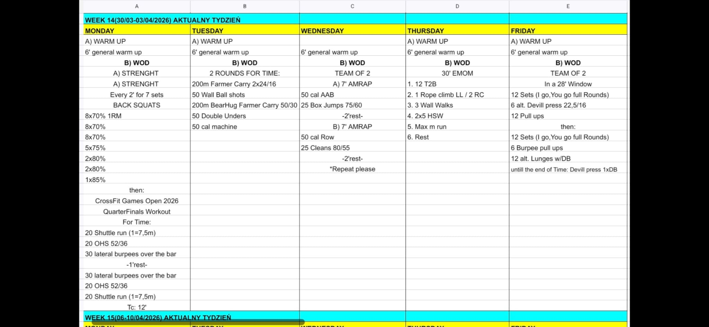

# Week 14 (30/03–03/04/2026)

## Source Screenshot

## Overview

Transcribed from the weekly board.

## Lesson Planning Notes

- Keep the whole week on a hard 60-minute class clock with single-start flow.
- Preserve stimulus with load and volume changes before changing movement patterns.
- Keep warm-ups implement-light and move barbell or workout-load rehearsal into
	Movement Prep.
- Solve bottlenecks before class starts, especially on Wed, Thu, and Fri.
- Use the rest built into interval formats as recovery, not as extra teaching time.

## Daily Workouts
- **[Monday](monday.md)** – Back Squat E2MOM (70–85%) + Open 2026 QuarterFinals palindrome chipper (shuttle / OHS / lateral burpees)
- **[Tuesday](tuesday.md)** – 2 Rounds for Time: farmer carry + wall balls + bearhug carry + DU + machine cals
- **[Wednesday](wednesday.md)** – Team of 2: 2 cycles of alternating 7' AMRAPs (AAB+box jumps / row+cleans) with 2' rests
- **[Thursday](thursday.md)** – 30 EMOM: T2B / rope climb / wall walks / HSW / max run / rest
- **[Friday](friday.md)** – Team of 2, 28' window: I-go-you-go devil press+pull-ups, then burpee pull-ups+lunges, then AMRAP devil press

## Equipment Needs

- Racks, barbells, plates (Mon, Wed)
- Assault bike, rower (Wed, Tue)
- Rope climbs, pull-up rig (Thu, Fri)
- Boxes 75/60 cm (Wed)
- Dumbbells 22.5/16 kg (Fri)
- DB/KB 2x24/16 kg + sandbag/bumper 50/30 kg (Tue)
- Open wall space + 10 m clear floor (Thu)

## Focus Areas

- **Overhead squat** (Mon, Wed): shoulder stability and lat engagement
- **Gymnastics capacity** (Thu): T2B, rope, wall walks, HSW in a 30-min EMOM
- **Grip endurance** (Tue): back-to-back carry variations
- **Team pacing** (Wed, Fri): clean handoffs, constant output
- **Room flow** (weekwide): pre-staged lanes, protected stations, no traffic crossovers
