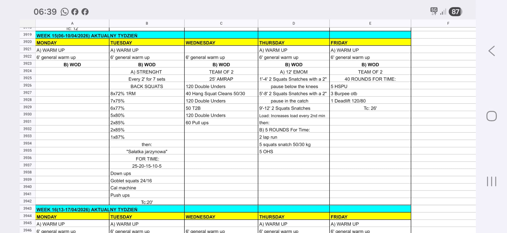

# Week 15 (06-10/04/2026)

## Source Screenshot

[Open source screenshot](../../../assets/images/week_15_source.jpeg)

**Weekly Focus:** Squat strength, long team mixed-modal work, snatch positioning, and a short heavy team grind.

## Lesson Planning Notes

- Keep the week on a hard 60-minute class clock with single-start logistics.
- Preserve stimulus through load and volume changes before swapping movement patterns.
- Use movement prep, not the main warm-up, for empty-bar or workout-load rehearsal.
- Solve equipment bottlenecks on paper before class starts, especially Wed and Fri.
- Keep Monday as a placeholder until the missing source is recovered rather than inventing a false session.

## Daily Workouts
- **[Monday](monday.md)** - Placeholder only: source image shows warm-up but not the training piece
- **[Tuesday](tuesday.md)** – Back Squat E2MOM build, then "Salatka jarzynowa" descending chipper
- **[Wednesday](wednesday.md)** – Team of 2, 25' AMRAP: DU + hang squat cleans + T2B + pull-ups
- **[Thursday](thursday.md)** – 12' squat snatch EMOM with pauses, then 5 rounds for time of run + snatch + OHS
- **[Friday](friday.md)** – Team of 2, 40 rounds for time: HSPU + burpee over bar + deadlift

## Equipment Needs

- Racks, barbells, plates (Tue, Thu, Fri)
- Jump ropes and pull-up rig (Wed)
- Wall space for HSPU (Fri)
- Machine for calories (Tue)
- Open run lane / lap course (Thu)
- Kettlebell or dumbbell 24/16 kg for goblet squats (Tue)

## Focus Areas

- **Back squat strength** (Tue): steady loading with seven E2MOM sets
- **Team pacing** (Wed, Fri): small sets, fast handoffs, no dead stops
- **Snatch positions** (Thu): patience below the knee and stability in the catch
- **Simple conditioning density** (Tue): unbroken movement through a descending rep ladder
- **Class logistics** (weekwide): single-start flow, lane clarity, and stimulus-preserving scales