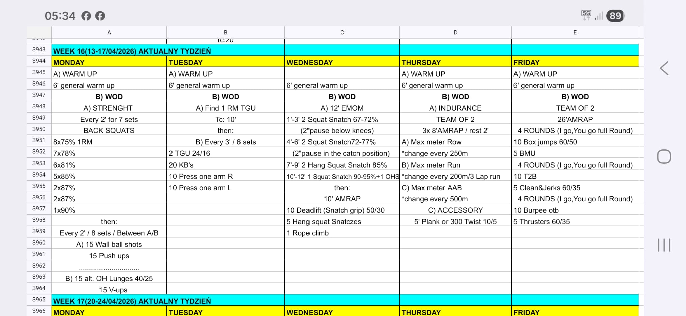

# Week 16 (13-17/04/2026)

## Source Screenshot

[Open source screenshot](../../../assets/images/week_16_source.jpg)

**Weekly Focus:** Back squat peak, KB skill work, snatch
positioning wave, aerobic endurance stations, and a
multi-block team grinder on Friday.

## Daily Workouts
- **[Monday](monday.md)** – Back Squat E2MOM to 90%, then
  alternating couplet EMOM: wall balls/push-ups vs.
  OH lunges/V-ups
- **[Tuesday](tuesday.md)** – Find 1RM TGU, then E3MOM KB
  complex: TGU + swings + one-arm press
- **[Wednesday](wednesday.md)** – Squat snatch EMOM wave
  (pauses → heavy single), then 10' AMRAP: DL + hang squat
  snatch + rope climb
- **[Thursday](thursday.md)** – Team of 2 endurance: 3x 8'
  AMRAP on row / run / AAB, then plank or Russian twist
  accessory
- **[Friday](friday.md)** – Team of 2, 26' AMRAP: three
  I-go-you-go blocks (box jumps + BMU, T2B + C&J, burpee
  OTB + thrusters)

## Lesson Planning Notes

- Keep the week on a hard 60-minute class clock with
  single-start flow.
- Preserve stimulus with load and volume changes before
  changing movement patterns.
- Keep warm-ups implement-light and move workout-load
  rehearsal into Movement Prep.
- Solve bottlenecks before class starts, especially on
  Thursday (machine assignment) and Friday (bar + box
  per team).
- Use built-in rest windows for recovery and reset, not
  extra teaching drift.

## Equipment Needs

- Rack, barbell, plates (Mon, Wed, Fri)
- Wall balls, dumbbells/KBs 40/25 kg (Mon)
- Kettlebells — heavy for TGU, 24/16 for complex (Tue)
- Climbing rope (Wed)
- Rowing machine, open run lane, Assault Air Bike (Thu)
- Boxes 60/50 cm, barbell 60/35 kg, pull-up rig (Fri)

## Focus Areas

- **Back squat peak** (Mon): highest week-over-week
  percentage in the current cycle — 1 @ 90%
- **KB skill** (Tue): Turkish get-up 1RM, then volume
  complex with consistent pace
- **Snatch positions** (Wed): four distinct technique
  blocks before conditioning
- **Aerobic base** (Thu): sustained team effort across
  three modalities — keep transitions tight
- **Team gymnastics + barbell cycling** (Fri): three
  sequential couplets; pacing in block 1 protects
  blocks 2 and 3
