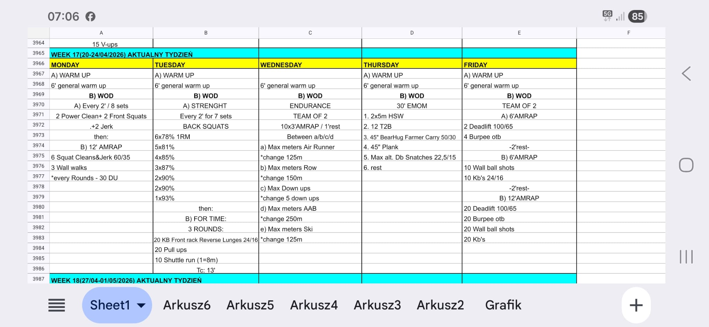

# Week 17 (20-24/04/2026)

## Source Screenshot

[Open source screenshot](../../../assets/images/week_17_source.jpeg)

**Weekly Focus:** Clean and jerk barbell cycling, back squat peak,
team aerobic station work, long gymnastics EMOM density, and a
Friday team progression from short sprint rounds into a longer
mixed-modal grind.

## Daily Workouts
- **[Monday](monday.md)** – Clean complex every 2:00, then 12'
  AMRAP: squat clean and jerk + wall walks + double unders
- **[Tuesday](tuesday.md)** – Back squat wave to 93%, then 3
  rounds for time: KB front rack reverse lunges + pull-ups +
  shuttle runs
- **[Wednesday](wednesday.md)** – Team of 2 endurance: 10 x 3'
  AMRAP / 1' rest rotating across Air Runner, row, down-ups,
  Assault Air Bike, and ski
- **[Thursday](thursday.md)** – 30' EMOM: HSW, T2B, bearhug
  carry, plank, max alternating DB snatches, rest
- **[Friday](friday.md)** – Team of 2 three-part AMRAP ladder:
  deadlift + burpee OTB, then wall balls + KB swings, then full
  20-rep mixed-modal rounds

## Lesson Planning Notes

- Keep the week on a hard 60-minute class clock with
  single-start flow.
- Preserve stimulus with load reductions before changing the
  movement pattern, especially Monday clean and jerk work,
  Tuesday back squats, and Friday deadlifts.
- Keep warm-ups implement-light and move loaded rehearsal into
  Movement Prep.
- Solve lane setup before class starts on Wednesday, Thursday,
  and Friday so athletes never cross paths during work windows.
- Protect built-in rest windows and transitions instead of
  turning them into extra briefing time.

## Equipment Needs

- Barbells, plates, jump ropes, wall space (Mon)
- Racks, kettlebells 24/16 kg, pull-up rig, shuttle lane (Tue)
- Air Runner or run substitute, rower, Assault Air Bike, ski erg
  (Wed)
- Pull-up rig, wall space, sandbag or D-ball 50/30 kg, dumbbell
  22.5/15 kg (Thu)
- Barbell 100/65 kg, wall ball, kettlebell 24/16 kg, open bar
  lane (Fri)

## Focus Areas

- **Barbell cycling under fatigue** (Mon): smooth turnover from
  clean to front squat to jerk before a short technical AMRAP
- **Back squat peak** (Tue): seven-set wave tops out at 93%
  before unilateral pulling conditioning
- **Aerobic handoffs** (Wed): teammates switch often and chase
  repeatable output, not one big opening effort
- **Gymnastics density** (Thu): five rounds of handstand,
  hanging, trunk, carry, and DB work with one protected rest
- **Team pacing progression** (Fri): short fast rounds teach the
  handoff rhythm needed for the longer final AMRAP