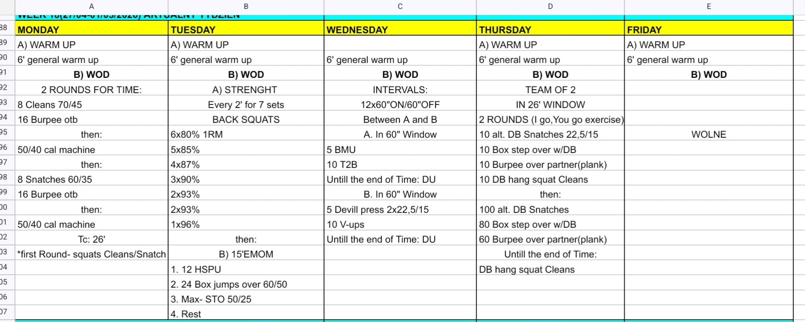

# Week 18 (27/04-01/05/2026)

## Source Screenshot

[Open source screenshot](../../../assets/images/week_18_source.jpeg)

## Overview

Transcribed from the week 18 source board provided in chat.

## Daily Workouts
- **[Monday](monday.md)** – 2 rounds for time: squat clean + burpee OTB + machine calories, then squat snatch + burpee OTB + machine calories
- **[Tuesday](tuesday.md)** – Back squat wave to 96%, then 4-station EMOM: HSPU, box jump overs, max STO, rest
- **[Wednesday](wednesday.md)** – 12 x 60" on / 60" off alternating BMU-T2B-DU and devil press-V-ups-DU intervals
- **[Thursday](thursday.md)** – Team of 2, 26' window: I-go-you-go DB primer rounds, then chipper into max DB hang squat cleans
- **[Friday](friday.md)** – Rest day / optional recovery work

## Lesson Planning Notes

- Keep the week on a hard 60-minute class clock with single-start flow.
- Preserve stimulus with load and volume changes before changing movement patterns, especially on Monday barbell reps and Tuesday back squats.
- Keep warm-ups implement-light and move workout-load rehearsal into Movement Prep.
- Solve bottlenecks before class starts on Monday and Thursday so machines, boxes, and partner lanes do not back up.
- Tuesday's source board lists four EMOM stations plus rest; program it as a 4-minute cycle so the work-rest structure is coherent.

## Equipment Needs

- Barbell, plates, calorie machine (Mon)
- Rack, box 60/50 cm, barbell, plates (Tue)
- Pull-up rig, jump ropes, dumbbells 2x22.5/15 kg (Wed)
- Dumbbell 22.5/15 kg, box 60/50 cm, open floor lane (Thu)
- Optional bike, rower, ski, or jog lane for recovery (Fri)

## Focus Areas

- **Mixed modal pacing** (Mon): keep the first machine effort controlled so the second barbell block stays stable.
- **Back squat peak + repeatable skill density** (Tue): heavy leg work before upper-body fatigue and barbell cycling.
- **Short interval discipline** (Wed): finish the buy-in fast enough to earn DU work without sprinting the opening reps.
- **Partner rhythm** (Thu): the first two rounds teach clean handoffs before the longer chipper starts.
- **Downshift** (Fri): use the day off to recover before the next training block.