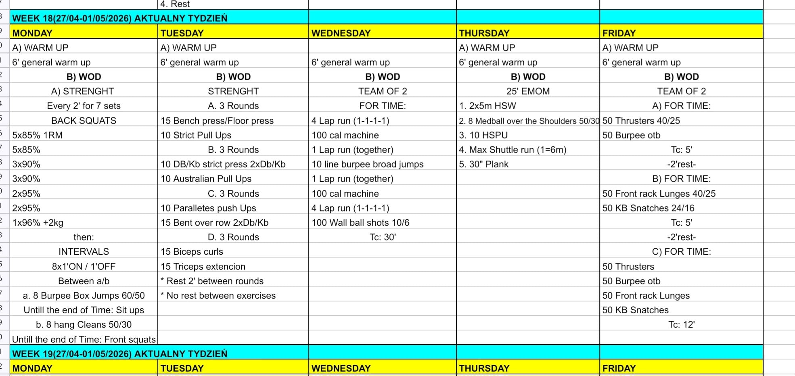

# Week 19 (04-08/05/2026)

## Source Screenshot

[Open source screenshot](../../../assets/images/week_19_source.jpeg)

## Overview

Transcribed from the week 19 source board provided in chat.

## Daily Workouts
- **[Monday](monday.md)** – Back squat peak to 96%+2kg, then 8x1' intervals alternating burpee box jumps + sit-ups and hang cleans + front squats
- **[Tuesday](tuesday.md)** – Upper-body strength endurance: four superset blocks (bench/pull-ups, strict press/Aussie pull-ups, paralette push-ups/bent row, curls/triceps)
- **[Wednesday](wednesday.md)** – Team of 2, for time: lap runs + machine calories + line burpee broad jumps + wall balls, Tc: 30'
- **[Thursday](thursday.md)** – 25' EMOM: handstand walk, medball over shoulder, HSPU, max shuttle runs, plank
- **[Friday](friday.md)** – Team of 2 sprint ladder: A) thrusters + burpees OTB (Tc: 5'), B) FR lunges + KB snatches (Tc: 5'), C) all four (Tc: 12')

## Lesson Planning Notes

- Keep the week on a hard 60-minute class clock with single-start flow.
- Preserve stimulus with load and volume changes before changing movement patterns, especially Monday back squats and Friday thruster loading.
- Keep warm-ups implement-light and move workout-load rehearsal into Movement Prep.
- Tuesday is a full upper-body strength day with no separate conditioning; pace the four superset blocks so all fit within 60 min including warmup.
- Solve bottlenecks before class on Wednesday (machine assignment) and Friday (barbell + KB per team, OTB lane marked).
- Thursday shuttle cones (6m) must be set before class so athletes self-count reps each round.

## Equipment Needs

- Rack, barbell, plates, box 60/50 cm, AbMat (Mon)
- Barbell, bench or floor space, pull-up rig, DBs/KBs, paralettes (Tue)
- Calorie machine, wall balls 10/6 kg, open running lane (Wed)
- Wall space for HSW, medball 50/30 kg, HSPU wall/rig, cones at 6m, mat (Thu)
- Barbell 40/25 kg, KB 24/16 kg, open OTB lane per team (Fri)

## Focus Areas

- **Back squat peak + interval scoring** (Mon): heavy loading before fast alternating intervals that test both power and barbell cycling under fatigue.
- **Upper-body density** (Tue): four push-pull supersets build volume across all planes; keep transitions brief to stay on time.
- **Team aerobic chipper** (Wed): manage machine pacing early so the back laps and wall balls still feel controlled.
- **EMOM quality across 5 rounds** (Thu): five different demands per cycle—keep each station crisp rather than just surviving.
- **Sprint-rest-sprint ladder** (Fri): parts A and B teach the effort ceiling before Part C asks for consistency across all four movements.
