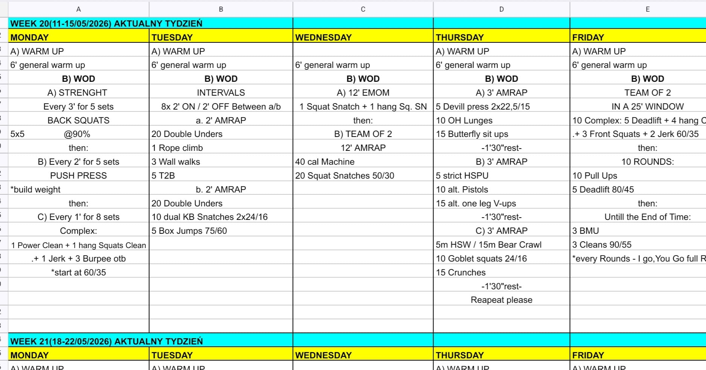

# Week 20 (11-15/05/2026)

## Source Screenshot

[Open source screenshot](../../../assets/images/week_20_source.jpeg)

## Overview

Transcribed from the week 20 source board provided in chat.

## Daily Workouts
- **[Monday](monday.md)** – Back squat 5x5 working sets, push press build, then 8' EMOM of clean-clean-jerk + burpees OTB
- **[Tuesday](tuesday.md)** – 8 x 2' on / 2' off alternating rope-wall-T2B AMRAPs with DU-KB-box AMRAPs
- **[Wednesday](wednesday.md)** – 12' squat snatch + hang squat snatch EMOM, then team of 2 12' AMRAP of machine calories and squat snatches
- **[Thursday](thursday.md)** – Three 3' AMRAP lanes repeated twice: devil press + OH lunges, HSPU + pistols, HSW/bear crawl + goblet squats
- **[Friday](friday.md)** – Team of 2, 25' window: barbell complex block, pull-up/deadlift rounds, then BMU + cleans in remaining time

## Lesson Planning Notes

- Keep the week on a hard 60-minute class clock with single-start flow.
- Monday and Wednesday both have technical barbell work before conditioning; protect the reset windows so athletes hit the main piece fresh.
- Tuesday and Thursday are interval-style days; stage lanes before class so rest windows stay real.
- Friday needs plate changes solved before the workout starts; one team per bar and rig bay is the cleanest setup.
- Preserve stimulus with load changes first, then volume, then movement substitutions.

## Equipment Needs

- Rack, barbell, plates, open OTB lane (Mon)
- Rope climb station, wall space, rig, jump ropes, dual KBs, box (Tue)
- Barbell, plates, machine or shuttle lane (Wed)
- Dumbbells, wall space, clear floor lane, goblet implement (Thu)
- Pull-up rig, barbell, plates in three loads (Fri)

## Focus Areas

- **Strength into barbell density** (Mon): heavy squats and push press set the tone before a short mixed barbell EMOM.
- **Repeat-sprint skill windows** (Tue): athletes should attack the work and use the full rest.
- **Snatch quality under breathing load** (Wed): the machine should raise pressure without wrecking bar path.
- **Gymnastic position under fatigue** (Thu): short blocks reward consistency more than chaos.
- **Partner handoff discipline** (Fri): fixed early volume determines how much time teams earn for the BMU cash-out.