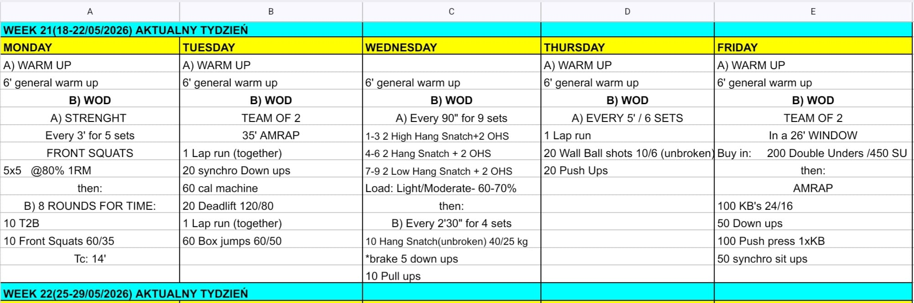

# Week 21 (18-22/05/2026)

## Source Screenshot

[Open source screenshot](../../../assets/images/week_21_source.jpeg)

## Overview

Transcribed from the week 21 source board provided in chat.

## Daily Workouts
- **[Monday](monday.md)** – Front squat strength, then 8 rounds for time of toes-to-bar and front squats
- **[Tuesday](tuesday.md)** – Team of 2, 35-minute AMRAP with runs, synchro down-ups, machine calories, deadlifts, and box jumps
- **[Wednesday](wednesday.md)** – Snatch-position work every 90 seconds, then a 4-set hang snatch + down-up + pull-up interval
- **[Thursday](thursday.md)** – 6 rounds of 5-minute intervals with run, wall balls, and push-ups
- **[Friday](friday.md)** – Team of 2, 26-minute window with rope buy-in, kettlebell work, down-ups, push press, and synchro sit-ups

## Lesson Planning Notes

- Keep the week on a hard 60-minute class clock with single-start flow.
- Monday and Wednesday both depend on crisp barbell positions; protect the transition time so athletes start the main work fresh.
- Tuesday and Friday are long partner pieces; stage lanes and split equipment before class to keep handoffs clean.
- Thursday is a repeatable interval day. Make sure athletes understand the 5-minute clock before the first rep starts.
- Preserve stimulus with load and volume changes before changing movement patterns.

## Equipment Needs

- Rack, barbell, plates, pull-up rig (Mon)
- Open lane, machine or shuttle substitute, barbell, plates (Tue)
- Barbell, plates, pull-up rig, open floor (Wed)
- Run lane, wall ball target, open floor (Thu)
- Jump ropes, kettlebell, open floor (Fri)

## Focus Areas

- **Squat density** (Mon): the short metcon should feel aggressive without blowing up the front rack.
- **Partner pacing** (Tue): keep the run and machine work honest so the later rounds still move.
- **Snatch quality under fatigue** (Wed): crisp positions matter more than chasing load.
- **Repeatable interval output** (Thu): the best score comes from controlling the first two sets.
- **Rope and KB rhythm** (Fri): the buy-in sets the tone for how much work teams buy themselves later.