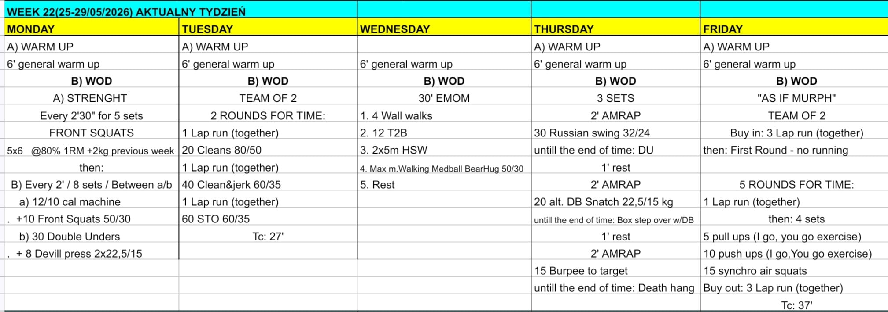

# Week 22 (25-29/05/2026)

## Source Screenshot

[Open source screenshot](../../../assets/images/week_22_source.jpeg)

## Overview

Transcribed from the week 22 source board provided in chat.

## Daily Workouts
- **[Monday](monday.md)** – Front squat strength, then alternating 2-minute rounds of machine/front squats and double-unders/devil press
- **[Tuesday](tuesday.md)** – Team of 2, 2 rounds for time with shared laps, cleans, clean and jerks, and shoulder-to-overhead
- **[Wednesday](wednesday.md)** – 30-minute EMOM cycling wall walks, toes-to-bar, handstand walk, medball bear-hug carry, and rest
- **[Thursday](thursday.md)** – 3 sets of mixed 2-minute windows for Russian swings, dumbbell snatch + step-overs, and burpee-to-target + dead hang
- **[Friday](friday.md)** – Team of 2 "as if Murph" with group runs, alternating pull-ups and push-ups, and synchro air squats

## Lesson Planning Notes

- Keep the week on a hard 60-minute class clock with single-start flow.
- Monday and Tuesday both center on front-rack stamina; keep loads honest so athletes can still move with intent in the conditioning.
- Wednesday and Thursday are skill-fatigue days. Prioritize movement quality before chasing extra reps or meters.
- Friday is long and partner-dependent. Stage lanes early and brief the run standard before the class starts.
- Preserve stimulus with load and volume changes before changing movement patterns.

## Equipment Needs

- Rack, barbell, plates, machine or shuttle substitute, jump rope, dumbbells (Mon)
- Open run lane, barbell, plates (Tue)
- Pull-up rig, open wall space, medball, floor lane (Wed)
- Kettlebell, jump rope, dumbbell, box, target, pull-up rig (Thu)
- Open run lane, pull-up rig, open floor (Fri)

## Focus Areas

- **Front-rack repeatability** (Mon): athletes should leave enough margin in the squat work to attack the alternating intervals.
- **Partner barbell planning** (Tue): clean handoffs and clear rep splits matter more than sprinting the first run.
- **Gymnastics position control** (Wed): the rest minute should protect movement quality, not just heart rate.
- **Grip management** (Thu): each 2-minute window invites athletes to overreach; keep the first set sustainable.
- **Murph-style pacing** (Fri): the winning teams stay smooth on the runs and never let the upper-body work hit failure.