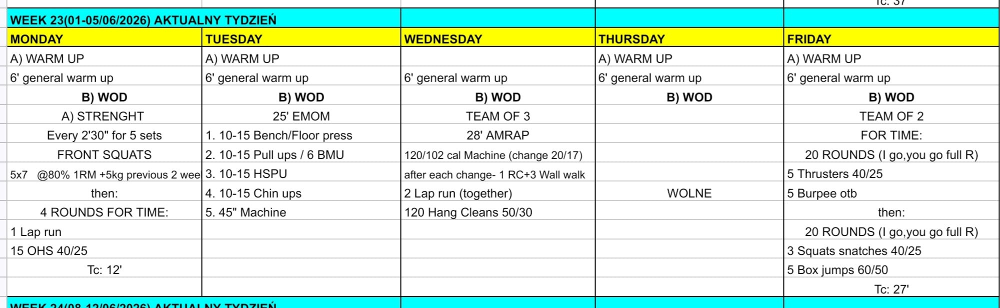

# Week 23 (01-05/06/2026)

## Source Screenshot

[Open source screenshot](../../../assets/images/week_23_source.jpeg)

## Overview

Transcribed from the week 23 source board provided in chat.

## Daily Workouts
- **[Monday](monday.md)** - Front squat volume every 2:30, then 4 rounds for time of lap runs and overhead squats
- **[Tuesday](tuesday.md)** - 25-minute EMOM rotating bench or floor press, pull-ups or bar muscle-ups, handstand push-ups, chin-ups, and machine work
- **[Wednesday](wednesday.md)** - Team of 3, 28-minute AMRAP with machine calories, rope climb plus wall-walk penalties at each change, shared running, and hang cleans
- **[Thursday](thursday.md)** - Rest day / optional recovery work
- **[Friday](friday.md)** - Team of 2 alternating full rounds first through thrusters and burpee-over-bar, then squat snatches and box jumps

## Lesson Planning Notes

- Monday and Friday both hinge on repeatable barbell cycling. Keep loads conservative enough that athletes can move with intent instead of surviving singles.
- Tuesday is dense upper-body volume. Athletes should choose rep targets that stay submaximal from round 1 so the later gymnastics stations do not collapse.
- Wednesday needs the clearest briefing of the week. Explain the machine change rule, the rope climb plus wall-walk tax, and when the whole team must regroup for the run.
- Thursday is marked "Wolne" on the board. Keep it as a true off day unless the gym explicitly wants an optional recovery class.
- Preserve stimulus by reducing load first, then volume, then movement complexity.

## Equipment Needs

- Rack, barbell, plates, open run lane (Mon)
- Bench or floor space, pull-up rig, wall space, machine (Tue)
- Machine, rope climb station, wall space, open run lane, barbell, plates (Wed)
- Optional bike, row, ski, or jog space for recovery work (Thu)
- Barbell, plates, open bar lane, box (Fri)

## Focus Areas

- **Front-rack stamina** (Mon): front squats should build leg fatigue without ruining the overhead position needed later.
- **Upper-body density** (Tue): athletes need disciplined rep choices to avoid hitting failure across pressing and pulling stations.
- **Team communication under fatigue** (Wed): every machine switch and transition needs a clear handoff plan.
- **Recovery discipline** (Thu): the goal is to feel better after the session, not to turn it into hidden intensity.
- **Partner handoff rhythm** (Fri): "I go, you go" rounds only work when each athlete leaves the bar and box ready for the next turn.