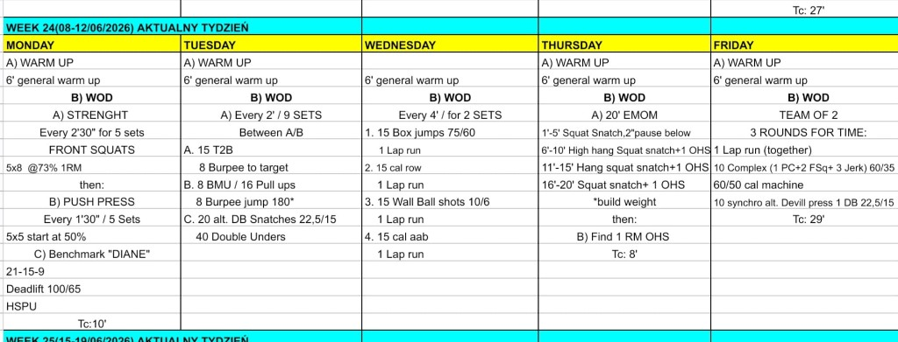

# Week 24 (08-12/06/2026)

## Source Screenshot

[Open source screenshot](../../../assets/images/week_24_source.png)

## Overview

Transcribed from the week 24 source board provided in chat.

## Daily Workouts
- **[Monday](monday.md)** - Front squat volume, push press build, then benchmark Diane
- **[Tuesday](tuesday.md)** - 9 rotating 2-minute intervals across toes-to-bar, bar muscle-ups or pull-ups, and dumbbell snatches with double-unders
- **[Wednesday](wednesday.md)** - Two sets of four 4-minute mixed-modal stations with box jumps, row, wall ball, and bike each paired with a lap run
- **[Thursday](thursday.md)** - 20-minute squat-snatch EMOM progression, then 1RM overhead squat test
- **[Friday](friday.md)** - Team of 2, three rounds for time with shared run, barbell complex, machine calories, and synchronized devil presses

## Lesson Planning Notes

- Monday stacks three distinct demands. Keep front squat and push press loads conservative enough that Diane still feels like a sprint, not survival mode.
- Tuesday needs the clearest lane briefing of the week. Athletes rotate A → B → C across nine sets, so every rig lane, rope, dumbbell, and target must be staged before round 1.
- Wednesday is transition-heavy. Walk the lane order once as a group so athletes know box → row → wall ball → bike → run without wandering mid-set.
- Thursday is the most technical day. Use the EMOM to build positions, then treat the 1RM overhead squat as a short, focused test — not a second metcon.
- Friday is explicitly programmed as teams of 2 on the source board. Brief the shared run and synchronized devil-press standard before the clock starts.
- Preserve stimulus by reducing load first, then volume, then movement complexity.

## Equipment Needs

- Rack, barbell, plates, wall space (Mon)
- Pull-up rig, jump rope, dumbbells, burpee target (Tue)
- Box, rower, wall ball, assault bike, open run lane (Wed)
- Barbell, plates, rack or platform (Thu)
- Barbell, plates, machine, dumbbell, open run lane (Fri)

## Focus Areas

- **Lower-body volume under fatigue** (Mon): front squats should build leg strength without ruining deadlift positions or inverted pressing later.
- **Gymnastics buy-in discipline** (Tue): athletes need repeatable rep choices so the ninth set looks like the third.
- **Transition speed** (Wed): the win is clean station flow inside each 4-minute window, not an early redline on the first box jumps.
- **Snatch positions under the clock** (Thu): load increases only when pause, catch, and overhead squat positions stay sharp.
- **Partner pacing** (Fri): teams that match effort on the run and devil presses will move faster than teams that sprint early and stall on the complex.
