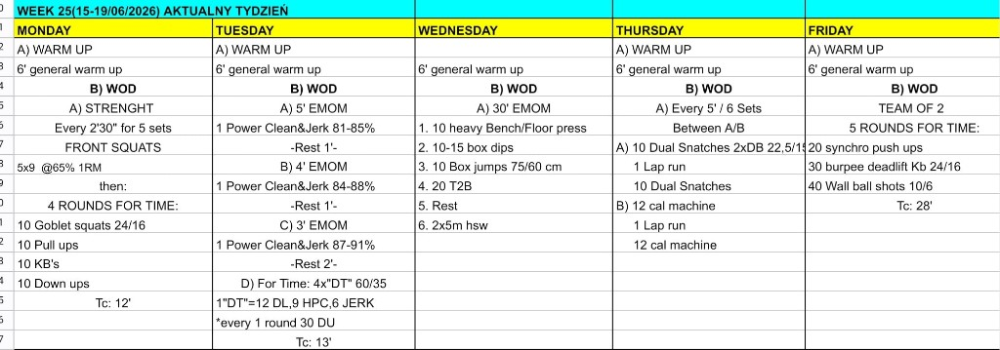

# Week 25 (15-19/06/2026)

## Source Screenshot

[Open source screenshot](../../../assets/images/week_25_source.png)

## Overview

Transcribed from the week 25 source board provided in chat.

## Daily Workouts
- **[Monday](monday.md)** - Front squat volume at 65%, then 4-round chipper with goblet squats, pull-ups, KB swings, and down-ups
- **[Tuesday](tuesday.md)** - Progressive power clean and jerk EMOM blocks, then 4 rounds of benchmark DT with double-unders after each round
- **[Wednesday](wednesday.md)** - 30-minute EMOM cycling bench or floor press, box dips, box jumps, toes-to-bar, rest, and handstand walk in sequence (5 rounds)
- **[Thursday](thursday.md)** - Six 5-minute intervals alternating dual dumbbell snatches and machine calories, each paired with lap runs
- **[Friday](friday.md)** - Team of 2, five rounds for time with synchronized push-ups, burpee deadlift KB swings, and wall balls

## Lesson Planning Notes

- Monday front squats are moderate load but high rep — keep athletes honest on depth so the chipper does not become a grip-and-pull survival piece.
- Tuesday is the heaviest barbell day. Use the 2-minute rest after the EMOM blocks so DT starts with crisp deadlift positions, not rushed strip-and-load chaos.
- Wednesday is skill-dense, not pace-dense. Walk the 6-station sequence once before the clock — athletes advance minute by minute, not in 5-minute blocks.
- Thursday needs a clear lane walk-through before set 1. The win is finishing each 5-minute window with time to spare, not sprinting the first snatch set.
- Friday is explicitly programmed as teams of 2 on the source board. Brief synchronized push-ups and the burpee-deadlift kettlebell standard before the clock starts.
- Preserve stimulus by reducing load first, then volume, then movement complexity.

## Equipment Needs

- Rack, barbell, plates, kettlebell, pull-up rig (Mon)
- Barbell, plates, jump rope (Tue)
- Bench, dip station, box, pull-up rig, wall space (Wed)
- Dumbbells, rower or bike, open run lane (Thu)
- Kettlebell, wall ball, open floor (Fri)

## Focus Areas

- **Squat volume under fatigue** (Mon): front squats should prime legs without destroying pull-up and swing mechanics in the chipper.
- **Barbell cycling discipline** (Tue): EMOM singles build confidence; DT rewards consistent touch-and-go, not hero singles.
- **Minute-by-minute pacing** (Wed): treat each EMOM station as its own set — heavy but repeatable.
- **Transition speed** (Thu): clean snatch-to-run and machine-to-run flow wins the day.
- **Partner pacing** (Fri): teams that stay synchronized on push-ups and split KB and wall-ball work evenly will outlast teams that sprint round 1.
