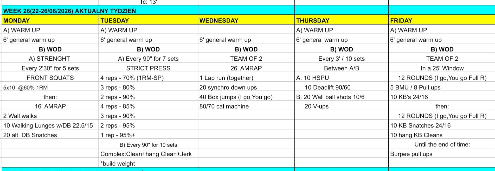

# Week 26 (22-26/06/2026)

## Source Screenshot

[Open source screenshot](../../../assets/images/week_26_source.jpeg)

## Overview

Transcribed from the week 26 source board provided in chat.

## Daily Workouts
- **[Monday](monday.md)** - Front squat volume at 60%, then a 16-minute AMRAP of wall walks, dumbbell walking lunges, and alternating dumbbell snatches
- **[Tuesday](tuesday.md)** - Strict press percentage ladder every 90 seconds, then 10 barbell complex sets of clean, hang clean, and jerk
- **[Wednesday](wednesday.md)** - Team-of-2 26-minute AMRAP with lap runs, synchronized down-ups, box jumps, and machine calories
- **[Thursday](thursday.md)** - 10 alternating 3-minute intervals of HSPU plus deadlifts and wall balls plus V-ups
- **[Friday](friday.md)** - Team-of-2 25-minute window with alternating full rounds of BMU or pull-ups with kettlebell swings, then kettlebell snatch and clean rounds into burpee pull-ups

## Lesson Planning Notes

- Monday is front-loaded leg volume before a shoulder-and-lunge AMRAP. Keep the squat loading honest so athletes still move well overhead in the metcon.
- Tuesday is a pure barbell development day. The strict press ladder should stay technically sharp, and the clean-hang clean-jerk complex should build only while footwork stays repeatable.
- Wednesday will bottleneck on machines and box space if lanes are not assigned before class. Clarify that the run is together and the box jumps are one partner at a time.
- Thursday is repeatability, not redline survival. Athletes should finish each 3-minute window with enough time to reset before the next station.
- Friday only works if teams understand the "I go, you go, full round" standard before the clock starts. Early pacing determines how much burpee-pull-up cash-out time they earn.
- Preserve stimulus by reducing load first, then volume, then complexity.

## Equipment Needs

- Rack, barbell, plates, dumbbells, wall space (Mon)
- Barbell, plates, rack or platform (Tue)
- Box, machine, open run lane (Wed)
- Wall space, barbell, plates, wall ball (Thu)
- Pull-up rig, kettlebell, open floor (Fri)

## Focus Areas

- **Squat stamina into overhead stability** (Mon): athletes should leave the strength block challenged, not cooked.
- **Overhead pressing quality** (Tue): every strict press rep and every jerk catch should look deliberate.
- **Partner pacing and transitions** (Wed): smooth handoffs matter more than sprinting the first round.
- **Interval discipline** (Thu): repeated work-rest execution is the whole point of the session.
- **Gymnastics gatekeeping under fatigue** (Fri): teams need a realistic pull scale so they actually reach the burpee-pull-up finish.