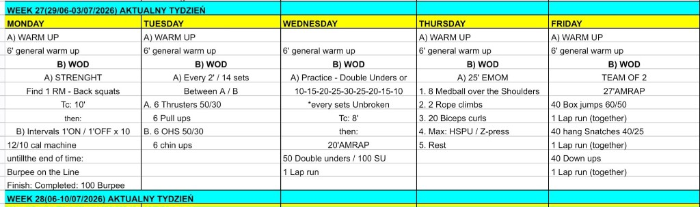

# Week 27 (29/06-03/07/2026)

## Source Screenshot

[Open source screenshot](../../../assets/images/week_27_source.png)

## Overview

Transcribed from the week 27 source board provided in chat.

## Daily Workouts
- **[Monday](monday.md)** - Back squat 1RM test, then 1' on / 1' off intervals: calories plus burpees on the line each on-minute to 100 total
- **[Tuesday](tuesday.md)** - Every 2 minutes for 14 sets, alternating thrusters and pull-ups with overhead squats and chin-ups
- **[Wednesday](wednesday.md)** - Unbroken double-under ladder practice, then a 20-minute AMRAP of double unders and a 350 m lap run
- **[Thursday](thursday.md)** - 25-minute EMOM rotating med-ball over shoulder, rope climbs, biceps curls, and max HSPU or Z-press
- **[Friday](friday.md)** - Team-of-2 27-minute AMRAP with box jumps, hang snatches, down-ups, and three shared 350 m lap runs

## Lesson Planning Notes

- Monday pairs a heavy squat test with engine work. Keep the 1RM attempt honest but brief so athletes still have legs for calories-and-burpee on-minutes.
- Tuesday is a barbell gymnastics couplet day. Athletes should pick one load that works for both thrusters and overhead squats, not two different bars.
- Wednesday bottlenecks on rope space for the skill block and the 350 m run lane for the AMRAP. Assign jump-rope lanes before the ladder starts.
- Thursday is station management more than redline conditioning. Rope climbs and HSPU need clear scaling paths before minute 1.
- Friday only works with defined partner rules: box jumps and snatches are I-go-you-go; runs and down-ups stay together. Budget ~4 min per shared 350 m run at moderate pace.
- Preserve stimulus by reducing load first, then volume, then complexity.

## Equipment Needs

- Rack, barbell, plates, machine (Mon)
- Barbell, plates, pull-up rig (Tue)
- Jump rope, open run lane (Wed)
- Med ball, rope, dumbbells, wall space (Thu)
- Box, barbell, plates, open run lane (Fri)

## Focus Areas

- **Squat max then repeatability** (Mon): hit a true 1RM without burning out before the interval block.
- **Barbell cycling under fatigue** (Tue): smooth thruster and OHS reps matter more than rushing the pull-ups.
- **Jump-rope consistency** (Wed): unbroken ladder sets build the rhythm needed for the AMRAP.
- **EMOM station discipline** (Thu): finish each minute with control so the next station does not collapse.
- **Partner pacing and transitions** (Fri): smooth handoffs on box jumps and snatches protect the shared runs.
