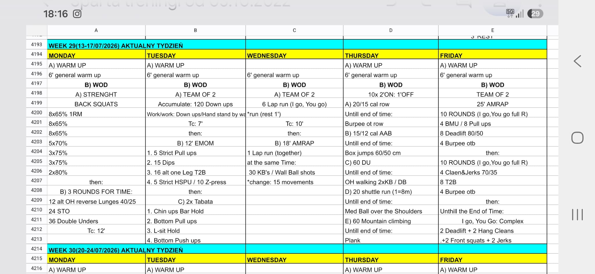

# Week 29 (13-17/07/2026)

## Source Screenshot

[Open source screenshot](../../../assets/images/week_29_source.jpeg)

## Overview

Transcribed from the week 29 source board screenshot (single-group start, 60-minute cap).

## Daily Workouts

- **[Monday](monday.md)** - Back squat percentage wave, then 3-round lunge/shoulder-to-overhead/jump rope triplet (TC 12')
- **[Tuesday](tuesday.md)** - Team-of-2 down-up accumulation, then strict EMOM + tabata holds
- **[Wednesday](wednesday.md)** - Team-of-2 interval runs, then 18' partner AMRAP with shared run + KB/WB work
- **[Thursday](thursday.md)** - 10× (2' on / 1' off) rotating row/AAB/DU/shuttle/steps stations
- **[Friday](friday.md)** - Team-of-2 25' AMRAP: two 10-round blocks, then barbell complex to finish

## Lesson Planning Notes

- Keep every day on a hard 60-minute clock with a single-group start.
- Preserve stimulus by scaling load first, then volume, then complexity/ROM.
- Pre-brief partner rules before the clock (I-go-you-go vs together) so pacing is consistent.
- Protect transition lanes on Thu (five stations) and Fri (rig + barbell congestion).
- Enforce built-in rests (Wed run rest, Thu 1' off, Tue tabata transitions) to keep quality high.
