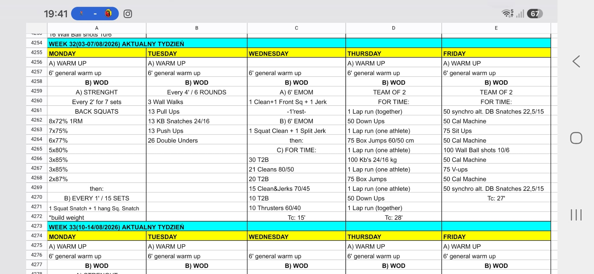

# Week 32 (03-07/08/2026)

## Source Screenshot

[Open source screenshot](../../../assets/images/week_32_source.jpeg)

## Overview

Transcribed from the week 32 source board screenshot (single-group start, 60-minute cap).

## Daily Workouts

- **[Monday](monday.md)** - Back squat percentage wave (E2MOM × 7), then E1MOM × 15: 1 squat snatch + 1 hang squat snatch (build)
- **[Tuesday](tuesday.md)** - Every 4:00 × 6: wall walks / pull-ups / KB snatches / push-ups / double-unders
- **[Wednesday](wednesday.md)** - Clean & jerk EMOMs (6'+1'+6'), then for-time T2B + barbell chipper (TC 15')
- **[Thursday](thursday.md)** - Team-of-2 for time (TC 28'): shared bookend laps, mid-laps one athlete, down-ups / box / KB swings
- **[Friday](friday.md)** - Team-of-2 for time (TC 27'): synchro alt DB snatches bookend with shared cals, sit-ups, wall balls, V-ups

## Lesson Planning Notes

- Keep every day on a hard 60-minute clock with a single-group start.
- Preserve stimulus by scaling load first, then volume, then complexity/ROM.
- Pre-brief partner rules before the clock (Thu mid-lap = one athlete; Fri synchro DB snatches).
- Protect wall + rig lanes on Tue; stage boxes/KBs before Thu; claim machines early on Fri.
- Enforce built-in rests (Mon snatch EMOM quality, Tue finish-inside-4:00, Wed 1' between complexes).
