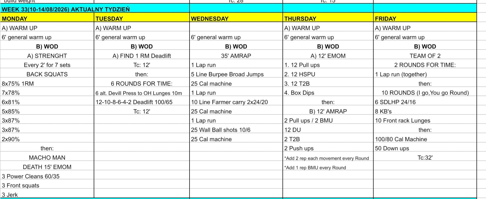

# Week 33 (10-14/08/2026)

## Source Screenshot

[Open source screenshot](../../../assets/images/week_33_source.jpeg)

## Overview

Transcribed from the week 33 source board screenshot (single-group start, 60-minute cap).

## Daily Workouts

- **[Monday](monday.md)** - Back squat percentage wave (E2MOM × 7), then Macho Man 15' EMOM (3 PC + 3 FS + 3 jerk @ 60/35)
- **[Tuesday](tuesday.md)** - Deadlift 1RM (TC 12'), then 6 rounds for time: devil press → 10 m OH lunges + DL ladder 12→2 (TC 12')
- **[Wednesday](wednesday.md)** - 35' AMRAP: laps + line burpee broad jumps / farmer carry / wall balls with 25-cal anchors
- **[Thursday](thursday.md)** - 12' gymnastics EMOM (PU / HSPU / T2B / box dips), then 12' ascending AMRAP with BMU
- **[Friday](friday.md)** - Team-of-2 for time (TC 32'): 2× (lap + 10 IGYG KB triplets), then 100/80 cal + 50 down-ups

## Lesson Planning Notes

- Keep every day on a hard 60-minute clock with a single-group start.
- Preserve stimulus by scaling load first, then volume, then complexity/ROM.
- Pre-brief partner rules before the clock (Fri I-go-you-go full round; shared lap + split buy-out).
- Protect platforms on Tue; mark burpee/farmer lines on Wed; assign rig + box lanes on Thu.
- Enforce finish-inside-the-minute on Mon Macho Man and Thu EMOM so quality funds the second piece.
