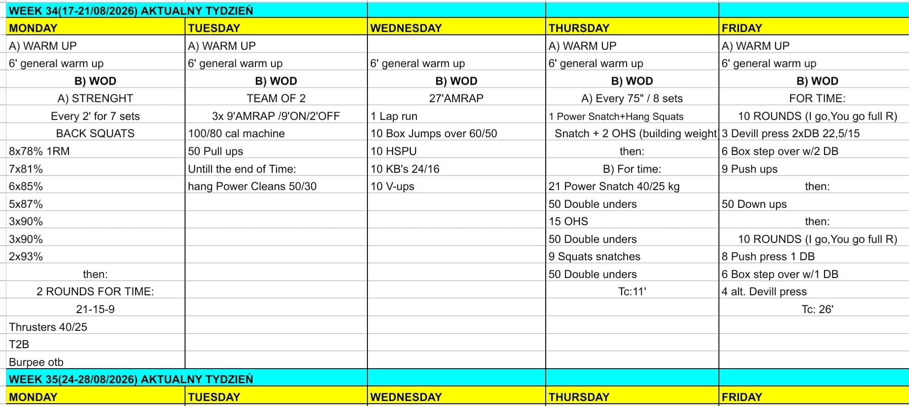

# Week 34 (17-21/08/2026)

## Source Screenshot

[Open source screenshot](../../../assets/images/week_34_source.jpeg)

## Overview

Transcribed from the week 34 source board screenshot (single-group start, 60-minute cap).

## Daily Workouts

- **[Monday](monday.md)** - Back squat percentage wave (E2MOM × 7), then 2 rounds for time of 21-15-9: thrusters / T2B / burpee OTB
- **[Tuesday](tuesday.md)** - Team-of-2: 3× 9' AMRAP / 2' off — 100/80 cal + 50 pull-ups, then hang power cleans (50/30)
- **[Wednesday](wednesday.md)** - 27' AMRAP: lap + box jump-overs / HSPU / KB swings / V-ups
- **[Thursday](thursday.md)** - Snatch complex E75s × 8, then for-time snatch / DU / OHS chipper (TC 11')
- **[Friday](friday.md)** - Team-of-2 for time (TC 26'): 10 IGYG devil-press triplets, 50 down-ups, 10 IGYG push-press triplets

## Lesson Planning Notes

- Keep every day on a hard 60-minute clock with a single-group start.
- Preserve stimulus by scaling load first, then volume, then complexity/ROM.
- Pre-brief partner rules before the clock (Tue split buy-ins + clean filler; Fri I-go-you-go full round).
- Protect machines + rig on Tue; wall/HSPU lanes on Wed; snatch floor space on Thu.
- Enforce the 2:00 off on Tue so each AMRAP starts fresh; Thu complex builds only when catches are quiet.
