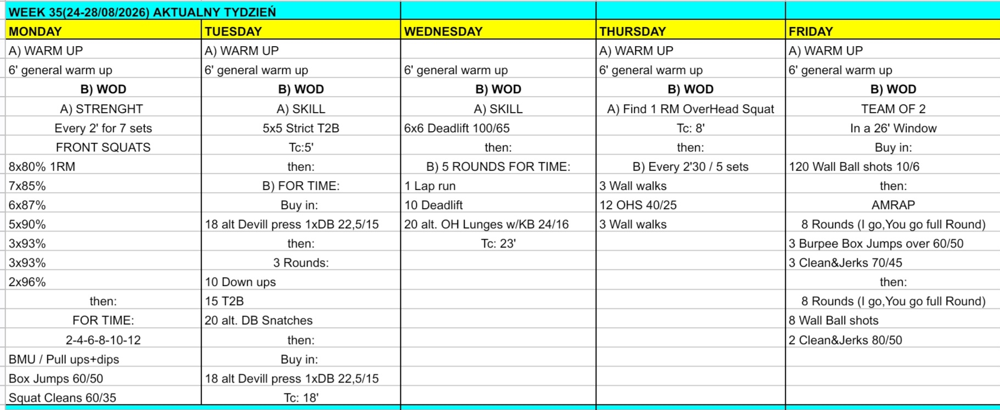

# Week 35 (24-28/08/2026)

## Source Screenshot

[Open source screenshot](../../../assets/images/week_35_source.jpeg)

## Overview

Transcribed from the week 35 source board screenshot (single-group start, 60-minute cap).

## Daily Workouts

- **[Monday](monday.md)** - Front squat percentage wave (E2MOM × 7), then descending 2-4-6-8-10-12 of gymnastics / box jumps / squat cleans
- **[Tuesday](tuesday.md)** - Strict T2B 5×5, then for time: devil-press buy-in/out around 3 rounds of down-ups / T2B / DB snatches
- **[Wednesday](wednesday.md)** - Deadlift 6×6, then 5 rounds for time: lap + deadlifts + alternating OH KB lunges
- **[Thursday](thursday.md)** - Overhead squat 1RM (TC 8'), then E2:30 × 5: wall walks / OHS / wall walks
- **[Friday](friday.md)** - Team-of-2 in 26': 120 wall-ball buy-in, then two 8-round I-go-you-go clean-and-jerk blocks

## Lesson Planning Notes

- Keep every day on a hard 60-minute clock with a single-group start.
- Preserve stimulus by scaling load first, then volume, then complexity/ROM.
- Pre-brief partner rules before the clock, especially Friday’s full-round I-go-you-go structure.
- Protect rig space on Tue, lane/running clarity on Wed, and wall/rack flow on Thu.
- Thursday only works if athletes finish early enough to rest; Friday only works if the wall-ball buy-in stays controlled.
