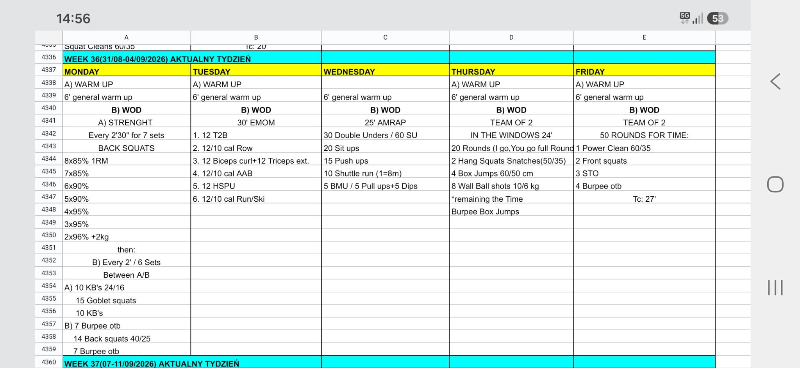

# Week 36 (31/08-04/09/2026)

## Source Screenshot

[Open source screenshot](../../../assets/images/week_36_source.jpeg)

## Overview

Transcribed from the week 36 source board screenshot (single-group start, 60-minute cap).

## Daily Workouts

- **[Monday](monday.md)** - Back squat percentage wave (E2:30 × 7), then E2MOM × 6 alternating KB/goblet vs burpee OTB + light back squat
- **[Tuesday](tuesday.md)** - 30' EMOM: T2B / row / curl+triceps / bike / HSPU / run-ski
- **[Wednesday](wednesday.md)** - 25' AMRAP: DU / sit-ups / push-ups / 8 m shuttle / BMU (or pull-ups + dips)
- **[Thursday](thursday.md)** - Team-of-2 in 24': 20 IGYG hang squat snatch / box / wall ball, then burpee box-jump filler
- **[Friday](friday.md)** - Team-of-2 for time (TC 27'): 50 IGYG rounds of PC + FS + STO + burpee OTB

## Lesson Planning Notes

- Keep every day on a hard 60-minute clock with a single-group start.
- Preserve stimulus by scaling load first, then volume, then complexity/ROM.
- Pre-brief partner rules before the clock (Thu/Fri I-go-you-go full round).
- Protect machine rotation on Tue; set 8 m shuttle cones on Wed; claim bars/boxes early on Thu/Fri.
- Monday only works if A/B alternation is clear before set 1; Tuesday scale HSPU early so minutes stay unfinished-with-rest.
