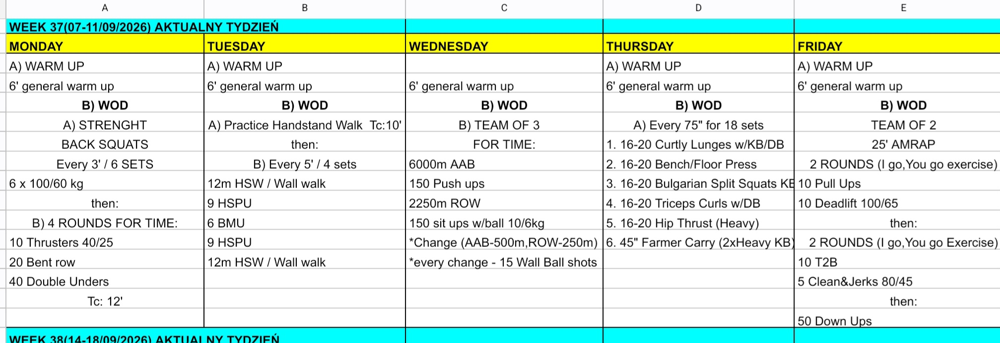

# Week 37 (07-11/09/2026)

## Source Screenshot

[Open source screenshot](../../../assets/images/week_37_source.jpeg)

## Overview

Transcribed from the week 37 source board screenshot (single-group start, 60-minute cap).

## Daily Workouts

- **[Monday](monday.md)** - Back squat E3MOM × 6 (6 @ 100/60), then 4 rounds for time: thrusters / bent rows / DU (TC 12')
- **[Tuesday](tuesday.md)** - Handstand walk practice (TC 10'), then E5MOM × 4: HSW / HSPU / BMU sandwich
- **[Wednesday](wednesday.md)** - Team-of-3 for time: 6000 m bike + 150 push-ups + 2250 m row + 150 ball sit-ups (WB tax on switches)
- **[Thursday](thursday.md)** - Every 75s × 18: curtsey lunges / press / Bulgarian SS / triceps / hip thrust / farmer carry
- **[Friday](friday.md)** - Team-of-2 25' AMRAP: IGYG pull-up+DL blocks, T2B+C&J blocks, then 50 down-ups

## Lesson Planning Notes

- Keep every day on a hard 60-minute clock with a single-group start.
- Preserve stimulus by scaling load first, then volume, then complexity/ROM.
- Pre-brief team rules before the clock (Wed switch distances + WB tax; Fri IGYG by exercise).
- Protect wall + rig lanes on Tue; claim bikes/rowers early on Wed; stage accessory stations on Thu.
- Tuesday only works if HSW/HSPU scales keep every 5:00 finishable; Wednesday wall-ball tax must be clear before meter 1.
