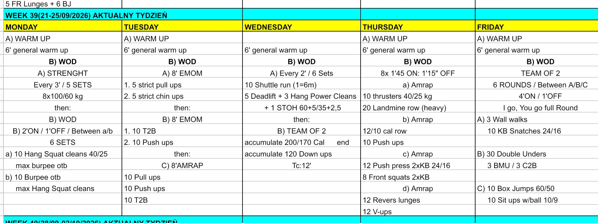

# Week 39 (21-25/09/2026)

## Source Screenshot

[Open source screenshot](../../../assets/images/week_39_source.jpeg)

## Overview

Transcribed from the week 39 source board screenshot (single-group start, 60-minute cap).

## Daily Workouts

- **[Monday](monday.md)** - Back squat 8×100/60 (E3MOM × 5), then 6× 2:00 on / 1:00 off alternating hang squat cleans ↔ burpee OTB
- **[Tuesday](tuesday.md)** - 8' EMOM strict pull/chin, 8' EMOM T2B/push-ups, then 8' AMRAP pull-ups / push-ups / T2B
- **[Wednesday](wednesday.md)** - E2MOM × 6: shuttle + building DL/HPC/STOH complex, then team accumulate cals + down-ups (TC 12')
- **[Thursday](thursday.md)** - 8× 1:45 on / 1:15 off rotating thruster-row / row-push-up / KB / lunge-V-up AMRAPs
- **[Friday](friday.md)** - Team-of-2: 6× 4:00 on / 1:00 off rotating wall-walk+KB / DU+BMU / box+medball (IGYG full round)

## Lesson Planning Notes

- Keep every day on a hard 60-minute clock with a single-group start.
- **Warmups are 15 min** (RAMP) from this week onward — protect the clock so strength/metcon still fit.
- Warmup flow: build equipment before 0:00, warm up in workout groups/lanes, run a coach-called clock, and use the 13:00-15:00 transition to load the first block.
- Preserve stimulus by scaling load first, then volume, then complexity/ROM.
- Pre-brief partner rules before the clock (Wed accumulate splits; Fri I-go-you-go full round).
- Protect shuttle lanes + bars on Wed; set four clear stations on Thu; claim wall/rig early on Fri.
- Monday a/b alternation must be clear before set 1; Wed complex builds +5/+2.5 each set from 60/35.
